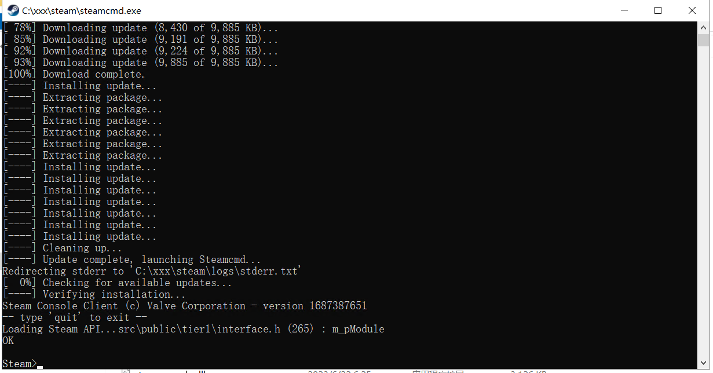

# V rising 私服搭建

## 一、安装

### 1.下载，解压Steamcmd，一定看清楚要解压。

### 2.启动Steamcmd.exe

当出现了`Steam>`表示进入了steam的控制台，可以进入下一步。



### 3.匿名登陆

```shell
login anonymous
```

因为网络问题，很可能会出现 time out 这样的文字，只需要重新输入命令就行了。

登陆成功：


### 4.安装V rising

VRising的服务器的appid是`1829350`

```shell
app_update 1829350 validate
```

耐心等待安装即可


## 二、初始化

> 笔者也曾试过单独弄一个文件夹来存放配置文件，考虑到上手的难度，大家可以直接在备份`默认配置`文件之后直接进行修改，然后直接启动服务器，非常的方便，而且不容易错，即使出错，一件导入默认备份文件也能快速恢复。

### 1.备份官方配置文件

- 默认配置文件一般在`steamapps\common\VRisingDedicatedServer\VRisingServer_Data\StreamingAssets\Settings`里面。
- 将这四个文件复制备份。

笔者这里就三个文件，少一个banlist文件不影响。


### 2.修改配置文件

> 切记！切记！一定不要直接复制网上那些教程的写好的服务器设置文件。
>
> 因为他们的`某些参数`在你的配置文件里是不应该存在的。
>
> 笔者就因为第一次直接复制别人的配置文件，导致服务器参数设置一直不生效，又因为忘记备份，无奈一行一行的寻找不应该存在的参数，将他们删掉。

最好的办法就是自己搜索自己需要的参数，搜索之后进行修改。

#### HostSettings的修改

下面注释了几个建议修改的选项，如果你的配置文件有，可以修改；没有的话，也不要添加。

```json
{
  "Name": "Fxxk", 
  "Description": "",
  "Port": 9876,		# 服务器登陆端口 需要在控制台开放端口
  "QueryPort": 9877,	# 服务器查询端口
  "MaxConnectedUsers": 10, # 最大人数
  "MaxConnectedAdmins": 4,
  "ServerFps": 30,	# 帧数，根据服务器性能决定
  "SaveName": "world3",
  "Password": "8989765",# 服务器密码
  "Secure": true,		# 服务器保护
  "ListOnMasterServer": true,
  "AutoSaveCount": 20,
  "AutoSaveInterval": 120, # 服务器多少秒自动保存一次
  "GameSettingsPreset": "",
  "AdminOnlyDebugEvents": true,
  "DisableDebugEvents": false,
  }
```

#### GameSettings的修改

列举了**部分**参数的说明。

切记！如果你的配置文件里面有，就修改，没有的话最好不要添加。

```json
{
  "GameModeType": "PvP", //游戏模式类型可选PvE
  "CastleDamageMode": "Always", //城堡伤害模式
  "SiegeWeaponHealth": "Normal", //攻城武器生命值
  "PlayerDamageMode": "Always", //玩家伤害模式
  "CastleHeartDamageMode": "CanBeDestroyedByPlayers", //城堡生命伤害模式
  "PvPProtectionMode": "Medium", //PvP保护模式
  "DeathContainerPermission": "Anyone", //死亡容器权限
  "RelicSpawnType": "Unique", //遗迹生成类型
  "CanLootEnemyContainers": true, //可以掠夺敌人的箱子
  "BloodBoundEquipment": true, //血缘装备
  "TeleportBoundItems": true, //传送绑定道具
  "AllowGlobalChat": true, //允许全局聊天
  "AllWaypointsUnlocked": false, //所有航路点已解锁
  "FreeCastleClaim": false, //自由城堡领地
  "FreeCastleDestroy": false, //自由城堡摧毁
  "InactivityKillEnabled": true, //已启用非活动清理
  "InactivityKillTimeMin": 3600, //非活动事件或AI清理最小时间
  "InactivityKillTimeMax": 604800, //非活动事件或AI清理最大时间
  "InactivityKillSafeTimeAddition": 172800, //非活动增加清理保护时间
  "InactivityKillTimerMaxItemLevel": 84, //非活动道具最大时间清理等级
  "DisableDisconnectedDeadEnabled": true, //启用无效连接断开
  "DisableDisconnectedDeadTimer": 60, //无效连接断开最大时间
  "InventoryStacksModifier": 1.0, //一堆库存道具百分比
  "DropTableModifier_General": 1.0, //常规数据删除百分比 
  "DropTableModifier_Missions": 1.0, //任务数据删除百分比
  "MaterialYieldModifier_Global": 1.0, //全局材料产量百分比
  "BloodEssenceYieldModifier": 1.0, //精血生产百分比
  "JournalVBloodSourceUnitMaxDistance": 25.0, //记录V血源装置最大距离
  "PvPVampireRespawnModifier": 1.0, //PVP吸血鬼复活概率
  "CastleMinimumDistanceInFloors": 2, //城堡楼层之间最小距离
  "ClanSize": 4, //宗族领主领地规模
  "BloodDrainModifier": 1.0, //精血消耗百分比
  "DurabilityDrainModifier": 1.0, //耐力消耗百分比
  "GarlicAreaStrengthModifier": 1.0, //大蒜面积强度百分比
  "HolyAreaStrengthModifier": 1.0, //神圣区域强度百分比
  "SilverStrengthModifier": 1.0, //银强度百分比
  "SunDamageModifier": 1.0,  //太阳伤害强度百分比
  "CastleDecayRateModifier": 1.0, //城堡衰退速度百分比
  "CastleBloodEssenceDrainModifier": 1.0, //城堡精血消耗百分比
  "CastleSiegeTimer": 420.0, //城堡攻城时间
  "CastleUnderAttackTimer": 60.0, //城堡受到攻击的时间
  "AnnounceSiegeWeaponSpawn": true, //通知攻城武器生成
  "ShowSiegeWeaponMapIcon": true, //显示攻城武器地图图标
  "BuildCostModifier": 1.0, //建筑成本百分比
  "RecipeCostModifier": 1.0, //配方成本百分比
  "CraftRateModifier": 1.0, //技能速度百分比
  "ResearchCostModifier": 1.0, //研究成本百分比
  "RefinementCostModifier": 1.0, //精炼成本百分比
  "RefinementRateModifier": 1.0, //精炼速度百分比
  "ResearchTimeModifier": 1.0, //研究时间百分比
  "DismantleResourceModifier": 0.75, //拆除成本百分比
  "ServantConvertRateModifier": 1.0, //仆人转化速度百分比
  "RepairCostModifier": 1.0, //维护成本百分比
  "Death_DurabilityFactorLoss": 0.25, //消亡耐久性损失系数
  "Death_DurabilityLossFactorAsResources": 1.0, //消亡耐久性资源损失系数
  "StarterEquipmentId": 0, //初始装备ID
  "StarterResourcesId": 0, //初始资源ID
  "VBloodUnitSettings": [], //V血液单位设置
  "UnlockedAchievements": [], //未锁定的成就
  "UnlockedResearchs": [], //未解锁的研究
  "GameTimeModifiers": { //游戏时间百分比
    "DayDurationInSeconds": 1080.0, //日持续时间（秒）
    "DayStartHour": 9, //白天开始时间
    "DayStartMinute": 0, //日开始分钟数
    "DayEndHour": 17, //白天结束时间
    "DayEndMinute": 0, 白天结束分数
    "BloodMoonFrequency_Min": 10, //血月频率最小值
    "BloodMoonFrequency_Max": 18, //血月频率最大值
    "BloodMoonBuff": 0.2 //血月buff
  }
```


## 三、XX，启动！

度过了安装和配置环节，下面的启动服务器环节特别简单。

在`steamapps\common\VRisingDedicatedServer`文件夹里面找到这个红色的exe，双击启动即可。


## 特殊环节

### 1.启动服务器失败

```shell
Failed to connect to vrising-client.s3.eu-central-1.amazonaws.com port 443 after 130628 ms: Timed out
```

则需要修改host

- 打开浏览器，打开<https://www.ipaddress.com/>，然后输入`vrising-client.s3.eu-central-1.amazonaws.com`来解析IP。
- 打开`C:\Windows\System32\drivers\etc\hosts`。
- 在最底下添加`xx.xx.xx.xx vrising-client.s3.eu-central-1.Amazonaws.com`，用你刚刚获取的IP替换xx。

### 2.如何更新V rising

安装和更新的代码一样，先匿名登陆，再进行安装

```shell
login anonymous
app_update 1829350 validate
```

## OU WA li
快乐玩耍吧！